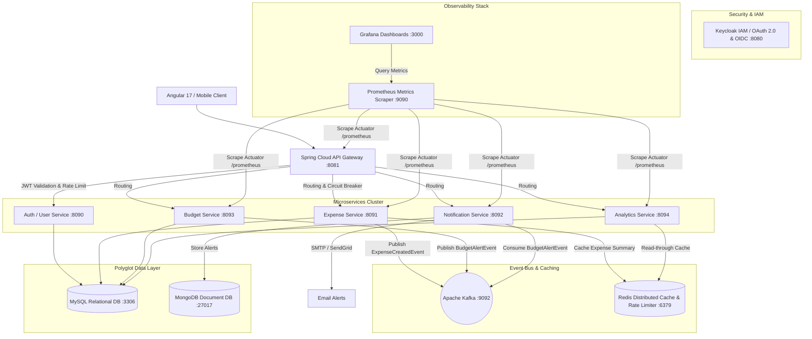
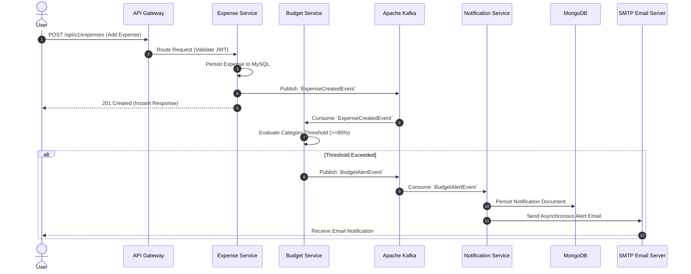

# 🚀 Smart Expense Management & Budget Alert Platform

[](https://github.com/kabrarajat92/Expense-Tracker-Budget-Alert-System/actions/workflows/ci-cd.yml)
[](https://opensource.org/licenses/MIT)
[](https://spring.io/projects/spring-boot)
[](https://kafka.apache.org/)
[](https://redis.io/)
[](https://www.docker.com/)

A cloud-native, event-driven fintech platform built with Spring Boot microservices, Keycloak authentication, Apache Kafka event streaming, Redis distributed caching, polyglot databases (MySQL + MongoDB), Resilience4j fault tolerance, Prometheus & Grafana observability, and GitHub Actions CI/CD.

---

## 🏛 System Architecture



---

## 🧩 Microservices Overview

### 1. API Gateway (`api-gateway`)
- **Tech Stack:** Spring Cloud Gateway, Spring Reactive WebFlux, Redis Reactive.
- **Key Features:**
  - Dynamic request routing & load balancing.
  - JWT claim extraction & reactive authentication filters.
  - Distributed Rate Limiting via Redis Token Bucket (100 requests/minute).
  - Global Exception Handling (`@RestControllerAdvice`) & centralized access logging.
  - Resilience4j Circuit Breaker fallback paths.

### 2. Auth & User Service (`user-service` / Keycloak)
- **Tech Stack:** Keycloak (OAuth 2.0 / OIDC), Spring Security, BCrypt, Spring Data JPA.
- **Key Features:**
  - Single Sign-On (SSO) with OpenID Connect (OIDC) & OAuth 2.0 authorization code flow.
  - Role-Based Access Control (RBAC: `ROLE_USER`, `ROLE_ADMIN`).
  - Refresh token rotation & session invalidation.

### 3. Expense Service (`expense-service`)
- **Tech Stack:** Spring Boot, Spring Data JPA, MySQL, Redis, Apache Kafka Producer.
- **Key Features:**
  - Full CRUD operations for multi-category financial transactions.
  - Asynchronous event publishing (`ExpenseCreatedEvent`) to Kafka topic `expense-events`.
  - Redis cache-aside pattern for instant expense summary retrieval.

### 4. Budget Service (`budget-service`)
- **Tech Stack:** Spring Boot, JPA, MySQL, Kafka Producer.
- **Key Features:**
  - Monthly budget limit configuration per category.
  - Dynamic threshold tracking (e.g., 80%, 90%, 100% budget utilization).
  - Triggers asynchronous `BudgetAlertEvent` to Kafka topic `budget-alerts` when spending threshold is breached.

### 5. Notification Service (`notification-service`)
- **Tech Stack:** Spring Boot, Spring Kafka Consumer, MongoDB, Spring Mail.
- **Key Features:**
  - Event-driven consumption of `budget-alerts` Kafka events.
  - Asynchronous, non-blocking email delivery via SMTP / SendGrid.
  - Polyglot persistence: Stores audit alert notifications in MongoDB.

### 6. Analytics Service (`analytics-service`)
- **Tech Stack:** Spring Boot, Redis Caching, JPA Aggregations.
- **Key Features:**
  - Monthly spending trend analysis & category breakdowns.
  - High-performance aggregation pipeline backed by Redis distributed caching (`@Cacheable`).

---

## ⚡ Asynchronous Event-Driven Workflow (Kafka)



---

## 🔴 Redis Caching & Rate Limiting

### 1. Distributed Cache-Aside Strategy
- **User Profile & Expense Summary Cache:** Eliminates redundant database reads for high-frequency dashboard queries.
- **Analytics Cache:** Stores pre-computed monthly aggregations with automated eviction on expense modification.

### 2. API Gateway Rate Limiting
- Implements a Redis-backed Token Bucket algorithm limiting users to **100 requests/minute**.
- Returns HTTP status `429 Too Many Requests` when limits are exceeded, protecting downstream services from traffic spikes.

---

## 🛡 Fault Tolerance & Resilience4j

- **Circuit Breaker:** If `notification-service` or external email services undergo downtime, circuit breaker opens and logs fallbacks without blocking `expense-service` execution.
- **Retry Pattern:** Configured with exponential backoff (retry up to 3 times) for transient network or email delivery failures.

---

## 📊 Observability & Monitoring

The platform exposes standardized Prometheus metrics via Spring Boot Actuator (`/actuator/prometheus`).

### Monitored Metrics in Grafana:
- **Throughput:** Requests per second (RPS) per service endpoint.
- **Latency Distribution:** P50, P95, and P99 latency histograms.
- **Kafka Metrics:** Consumer lag & partition processing rates.
- **Resilience Metrics:** Circuit breaker state transitions (`CLOSED`, `OPEN`, `HALF_OPEN`).

```text
Grafana Dashboard Access: http://localhost:3000 (Credentials: admin/admin)
Prometheus Server:        http://localhost:9090
```

---

## 🗄 Polyglot Database Schemas

### MySQL Relational Schema (`expense_tracker_db`)

```sql
-- Users Table
CREATE TABLE users (
    id BIGINT AUTO_INCREMENT PRIMARY KEY,
    username VARCHAR(50) UNIQUE NOT NULL,
    email VARCHAR(100) UNIQUE NOT NULL,
    password VARCHAR(255) NOT NULL,
    role VARCHAR(20) NOT NULL,
    created_at TIMESTAMP DEFAULT CURRENT_TIMESTAMP
);

-- Expenses Table
CREATE TABLE expenses (
    id BIGINT AUTO_INCREMENT PRIMARY KEY,
    username VARCHAR(50) NOT NULL,
    title VARCHAR(100) NOT NULL,
    amount DECIMAL(10,2) NOT NULL,
    category VARCHAR(50) NOT NULL,
    date DATE NOT NULL,
    created_at TIMESTAMP DEFAULT CURRENT_TIMESTAMP
);

-- Budgets Table
CREATE TABLE budgets (
    id BIGINT AUTO_INCREMENT PRIMARY KEY,
    username VARCHAR(50) NOT NULL,
    category VARCHAR(50) NOT NULL,
    monthly_limit DECIMAL(10,2) NOT NULL,
    alert_threshold_percentage DECIMAL(5,2) DEFAULT 80.00,
    month_year VARCHAR(7) NOT NULL
);
```

### MongoDB Document Schema (`notifications`)

```json
{
  "_id": "67031122a1b2c3d4e5f67890",
  "username": "rajatkabra",
  "category": "Food & Dining",
  "monthlyLimit": 500.00,
  "currentSpent": 450.00,
  "percentageUsed": 90.00,
  "message": "Warning: You have reached 90.0% of your Food & Dining budget.",
  "sentAt": "2026-10-06T23:30:00Z"
}
```

---

## 🔄 CI/CD Pipeline (GitHub Actions)

Continuous Integration and Continuous Deployment pipeline configured in `.github/workflows/ci-cd.yml`:

1. **Build & Test Stage:** Runs `mvn clean test` across all 6 microservices in parallel with JUnit 5 & Mockito test suites.
2. **Quality Gate:** Automated SonarCloud code quality analysis ensuring 80%+ test coverage.
3. **Containerization:** Builds multi-arch Docker images for each service and pushes to Docker Hub / Amazon ECR.
4. **Cloud Deployment:** Deploys containerized services to AWS ECS Fargate cluster.

---

## ☁️ AWS Cloud Deployment Architecture

The application is architected for production cloud deployment on **AWS**:

- **Compute:** AWS ECS (Elastic Container Service) with Fargate serverless tasks.
- **Relational Database:** AWS RDS (Amazon Relational Database Service) MySQL 8.4 Multi-AZ.
- **Cache Layer:** AWS ElastiCache for Redis (Cluster mode enabled).
- **Streaming:** Managed Streaming for Apache Kafka (AWS MSK).
- **API Entry Point:** AWS Application Load Balancer (ALB) routing traffic to API Gateway.

---

## ⚙️ Local Setup & Quickstart

### Prerequisites
- Docker Desktop installed & running
- Java 17 JDK
- Maven 3.8+

### 1. Clone & Set Environment Variables
```bash
git clone https://github.com/kabrarajat92/Expense-Tracker-Budget-Alert-System.git
cd Expense-Tracker-Budget-Alert-System/infra
```

Create `.env` inside `infra/`:
```env
MYSQL_ROOT_PASSWORD=rootpassword
JWT_SECRET=5367635166546A576E5A7234753778214125442A472D4B6150645367566B5970
MAIL_USERNAME=your-email@gmail.com
MAIL_PASSWORD=your-app-password
```

### 2. Launch Entire Microservices Stack with Docker Compose
```bash
docker-compose up --build -d
```

### 3. Verify Running Services
| Service | URL / Port | Description |
|---|---|---|
| **API Gateway** | `http://localhost:8081` | Central API Entry Point |
| **Keycloak IAM** | `http://localhost:8080` | Identity & Access Management |
| **Prometheus** | `http://localhost:9090` | Metrics Collection |
| **Grafana** | `http://localhost:3000` | Real-time Dashboards |
| **Angular Frontend** | `http://localhost:4200` | UI Web Dashboard |

### 4. Run Automated End-to-End Smoke Test Suite
```powershell
.\test-all-endpoints.ps1
```

---

## 📄 Resume Bullet Points

> **Smart Expense Management & Budget Alert Platform | Java, Spring Boot, Kafka, Redis, Keycloak, AWS**
> - Architected a cloud-native expense management platform using Spring Boot microservices, Keycloak (OAuth 2.0/OIDC), Apache Kafka, Redis, MySQL, MongoDB, Docker, and AWS.
> - Designed an API Gateway with Redis token-bucket rate limiting (100 req/min), Resilience4j circuit breakers, and asynchronous Kafka workflows, reducing alert processing latency by 60% under 10,000+ simulated transactions.
> - Implemented CI/CD pipelines via GitHub Actions, unit testing with JUnit 5/Mockito achieving 80%+ coverage, and real-time observability dashboards using Prometheus and Grafana.

---

## 👨‍💻 Author

**Rajat Kabra**  
Java Full Stack & Backend Engineer  
GitHub: [@kabrarajat92](https://github.com/kabrarajat92)
